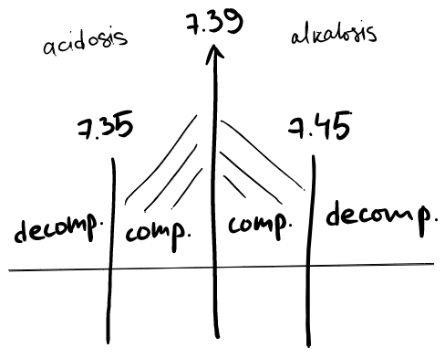
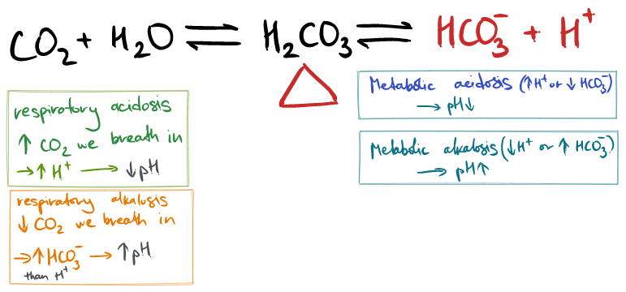
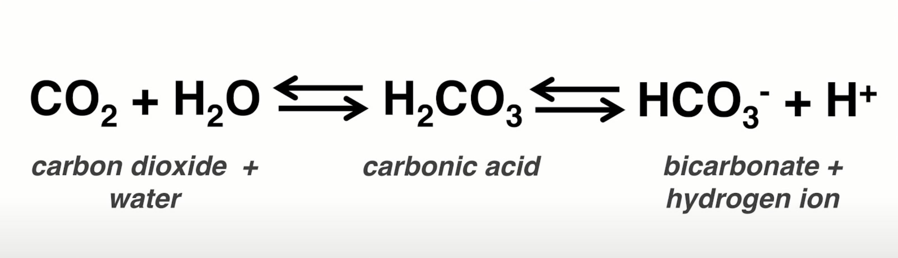
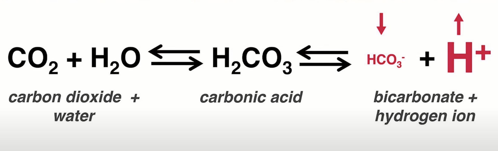
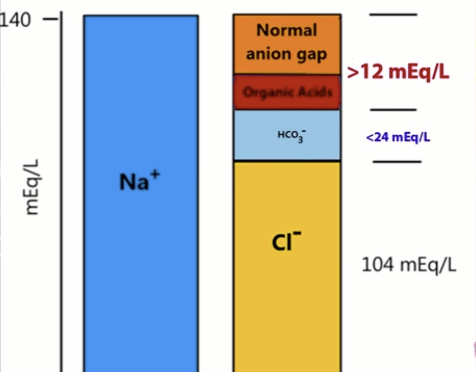

tags: #physiology #pathophysiology #acid-base-balance 
status: #inprogress 
flashcards: [[Acid-base disorders flashcards]]

---

re-study: 
[video: Acid base disturbances. Resp.Alk. Met.Alk. etc](https://youtu.be/stgY1QgpGxU) 
[SketchyPath](https://www.youtube.com/watch?v=XS8BOmdJxbo)
# Summary Concepts
- Hyperkalemia (↑$K_+$) → arrhythmia
- Sodium is most important in diagnostics for anesthesiologists
- Normal ABB (Acid-Base Balance) is regulated by [[Buffer systems homeostasis]].
- Normal $Na_+$ in blood = 135-145 mmol/L
- 
- 
- $PaCO_2$ predominantly controlled by the lungs. (i.e. increase ventilation and you breath off the $CO_2$)
- ↑ $CO_2$ has vasodilatatory effect on vessels (predominantly cerebral arteries)
# Sketchy
- Normal Buffer system
- 
- **Metabolic Acidosis**: 
	- ↑ $H_+$ 
		- This is what happens with a patient in ketoacidosis or ingest methylene glycol.
		- Mud piles: methanol, 
	- ↓ $HCO_3-$
		- In case of excessive amount of diarrhea or with the kidney abnormality which decreases bicarb reabsorption or production. (The kidney have ability to produce bicarbs)
	- Compensatory mechanisms make ventilation increase in order to breath off $CO_2$, which shifts equilibrium to the left.
		- Cornerstone of those compensatory mechanisms is that - *they never quite get the pH back to the baseline, but they try*.
	- Metabolic acidosis usually treated by replenishment of circulating blood volume. *(Восполнение ОЦК)*
- 
- 
	- Albumins are also anions, but they exists in lower concentrations. (orange Normal anion gap = 8-12 mEq/L)
		- Formalae for calculation anion gap:
			- None sHall Cross: Anion gap = Na - HCO3 - Cl