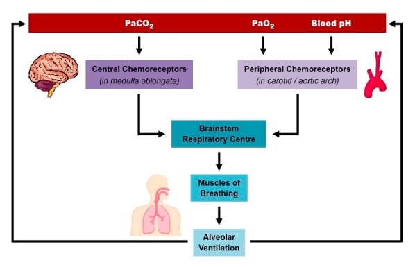

tags: #respiratory-system #emptylinks
>related topics: [[Respiratory system anatomy]] [[Buffer systems homeostasis]]
# Summary
- Ventilation disorders are usually worse at night.
# Concepts from lecture
- Breathing process is passive. This can be accomplished due to *negative pressure* in the lungs.
- **Anesthesiologist consider parameters of mechanical ventilation device:**
	- Minute volume of respiration (lungs) components:
		- Tidal volume ([[Spirometry basics]])
		- Breath rate
	- Concentration of the $FiO_2$
	- Extensibility of respiratory system *(which can be different in sportsman).*
	- Dead space volume (normally 150ml)
	- Even the volumes of tubes of mechanical ventilation device.
- **Pleura** has two layers: *visceral* and *parietal*.
- The respiratory center is located in the **medulla oblangala** and **pons**, in the **[[brainstem]]**.
	- Pons located on the level of C1 and C2.
- 
- **Myorelaxants** → muscles "turn off" → apnea (not breathing)

# Respiratory failure [1]
- **Type 1:** hypoxia alone, $PaO_2$ $<$ $8.0$ $kPa$ (60 mm Hg)
- **Type 2:** hypercapnia, $PaCO_2$ $>$ $6.0$ $kPa$ (50 mm Hg)

- Respiratory acid base disorders
## Type 1: Adult Respiratory Distress Syndrome (ARDS)
- Defined as $PaO_2$ $<$ $8.0$ $kPa$ no matter what $FiO_2$(inspired oxygen concentration) is
- Can be an acute one-off event or complication of chronic disease
### Treatment
- Of the cause
- Oxygen supplementation using high $FiO_2$:
	- Venturi mask 28%, 35%, 40%
	- Rebreathing bag is very hypoxic
	- Aim for: saturations above 94% and a comfortable respiratory rate

## Type 2: Diseases affecting lung ventilation with normal lungs
- Obstructive sleep apnoe
- Obesity hypoventilation
- Respiratory muscle and chest wall disease
# Reference
1. [Disorders of Respiratory Physiology – Other Respiratory Disorders | Lecturio](https://youtu.be/Clgg7tj3wKI)