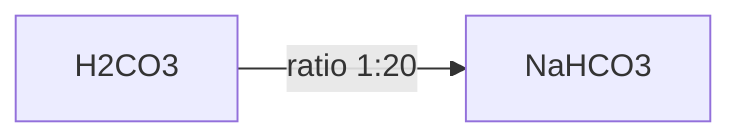
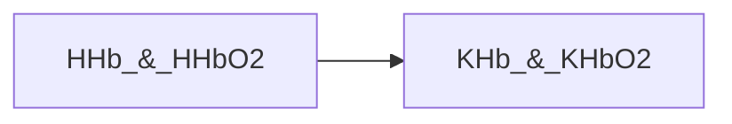

tags: #pathophysiology #physiology #acid-base-balance

# Buffer systems
## Bicarbonate buffer  (53% of all buffers) ($H_2$$CO_3$$/$$HCO_3-$)
*Responsible for breathing regulation.*

## Hb buffer  (35%) ($HbH$$/$$Hb-$)
*The most powerfull.*

## Protein buffer (7%) ($HPr$$/$$Pr$)
*Work at pH: 7.2-7.4. Amphoteric electrolytes(with free acidic or base groups)*

## Phosphate buffer  (5%) ($H_2$$PO_4-$$/$$HPO_4-$)
*Percentage is ↓, but important role in kidneys.*

## Ammonia/Ammonium ion buffer ($NH_3$$/$$NH_4+$)
*Acts predominantly in the urine.*

# References