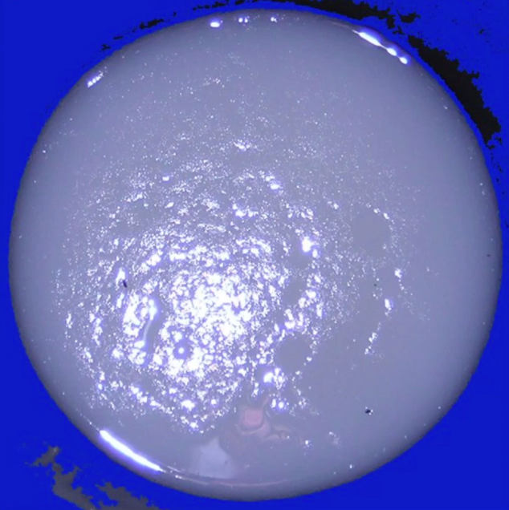
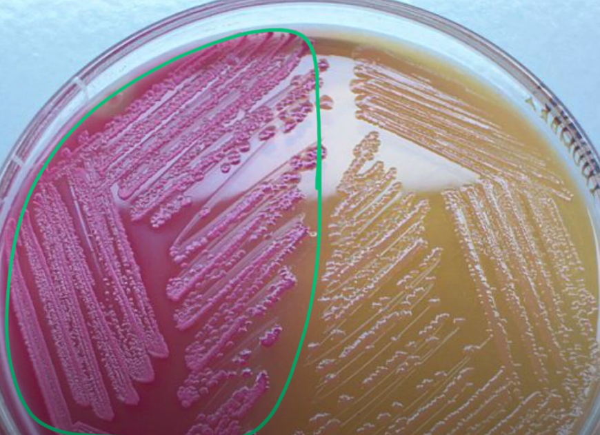

# Sketchy [1]

## Vibrio Cholera
- Pathogen: Vibrio Cholera, gram negative flagellated curved bacillus
- Endemic to developing countries
- Inactivated in acidic environment (acid labile)
	- So Proton Pump inhibitors (PPI) will make things worser
- Vibrio is *oxidase positive*
- Transmitted via ingestion of *contaminated water*
- Produces *Cholera toxin*
	- Cholera toxin overactivates adenylate cyclase resulting in increased levels of cAMP → results in chlorine secretion and water is pulled into the lumen of the intestinal tract → Watery [[Diarrhea]] (vibrio causes *"rice-water" diarrhea*)
- Cholera toxin DOES NOT invade the intersinal mucosa, rather it induces mucus production of goblet cells and causes epithelial cell to slough off. [^1] → this *gives a stool a rice appearance.*
	- Because the pathogen doesn't invade → there is *no blood or inflammatory debris* is present in the stool.
- White stool
	- Cholera toxin causes *stool to contain mucus and epithelial cells.*
	- 
- **Diagnosis**
	- Stool and Vomit to bacteriological analysis
	- PCR
- **Treatment**
	- Parenteral rehydration - potassium containing solution: (e.g.Trisol)
	- Oral rehydration
	- Antibiotics: cephalosporins,
	- Adsorbents (activated coal)
	- Fluoroquinolone

## Vibrio vulnificus
- Vibrio vulnificus *ferments lactose* on the mcconkey agar (appears pink)
	- 
- Associated with raw oyster and alcohol consumption
- Can cause sepsis and liver damage

## Case question
A resident physician is working in Ghana on a humanitarian trip when a 19-year-old male presents to the clinic with a 3-day history of watery diarrhea. He states that he recently drank some water that may have been contaminated. A stool sample reveals gram-negative, oxidase-positive, flagellated bacilli. The resident informs the medical team that his condition is caused by a toxin that:

A) Invades the gastrointestinal mucosa
B) Results in an absence of neutrophils in the stool
C) Spreads hematogenously to vital organs
D) Increases levels of cyclic GMP

>[!tip]- Answer
>B) Results in an absence of neutrophils in the stool
>
>Because vibrio cholera doesn't invade intestine, there is no blood or inflammation signs → stool only contain mucus and epithelial cells

# Flashcards

What is the pathogen of Cholera? #card 
Vibrio Cholera, gram negative flagellated curved bacillus
^1666718066646

What contains "rice-water" white stool in cholera? #card 
Mucus and epithelial cells
^1666718066650

Cholera is a dangerous disease, which can lead to death. How it can kill so fast? #card 
Excessive diarrhea can lead to 4th grade dehydration in few days.
There can be a point where it's irreversible process and leads to death.
^1666765270923

What is the pathophysiology of cramps in Cholera disease? #card 
With loss of water, there is also lost of electrolytes which can lead to the cramps in the limbs.
^1666765270929

# References

1. [Vibrio Cholerae & Vibrio Vulnificus for the USMLE Step 1](https://youtu.be/5FV0NPQbsfY)

[^1]: Slough off - шелушиться

