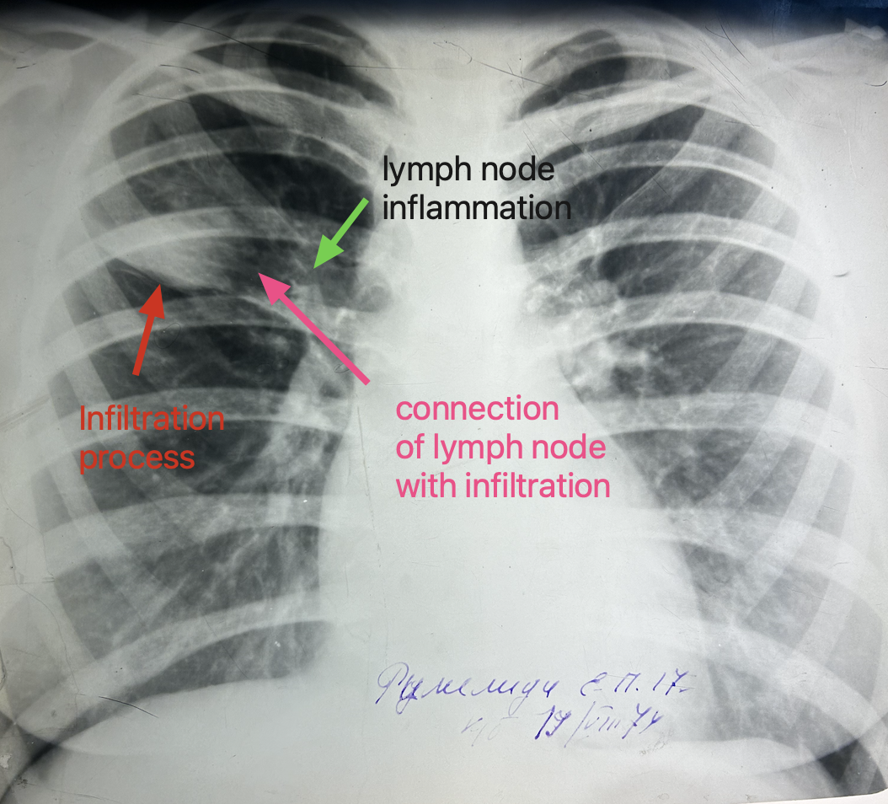
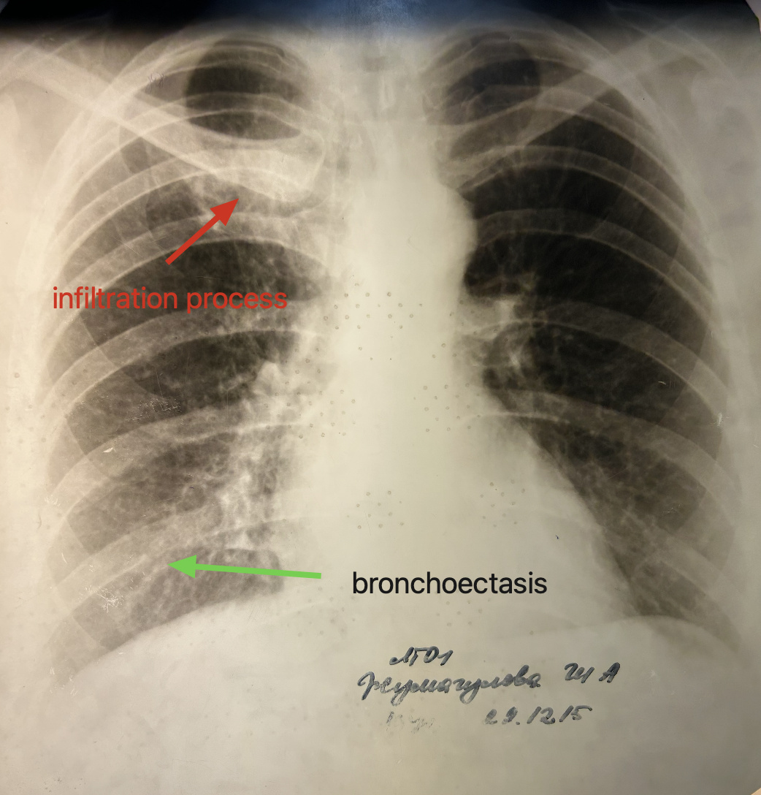
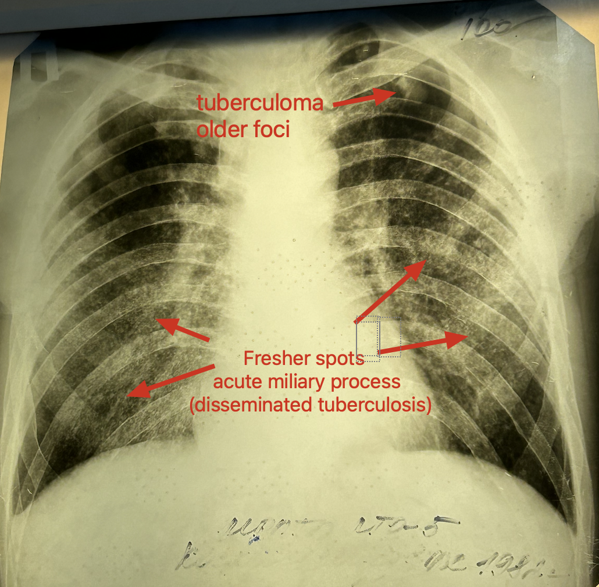
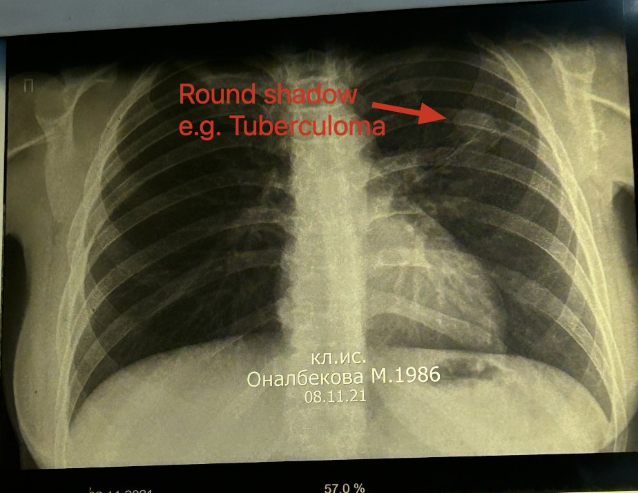
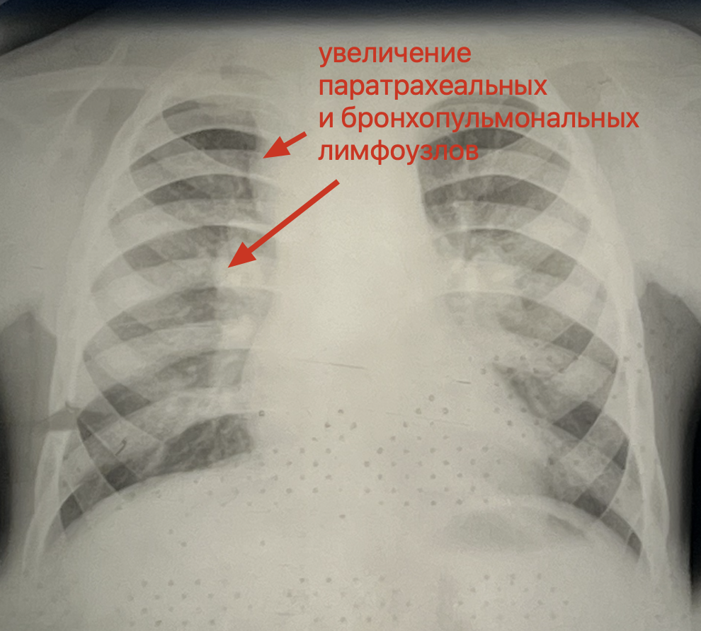
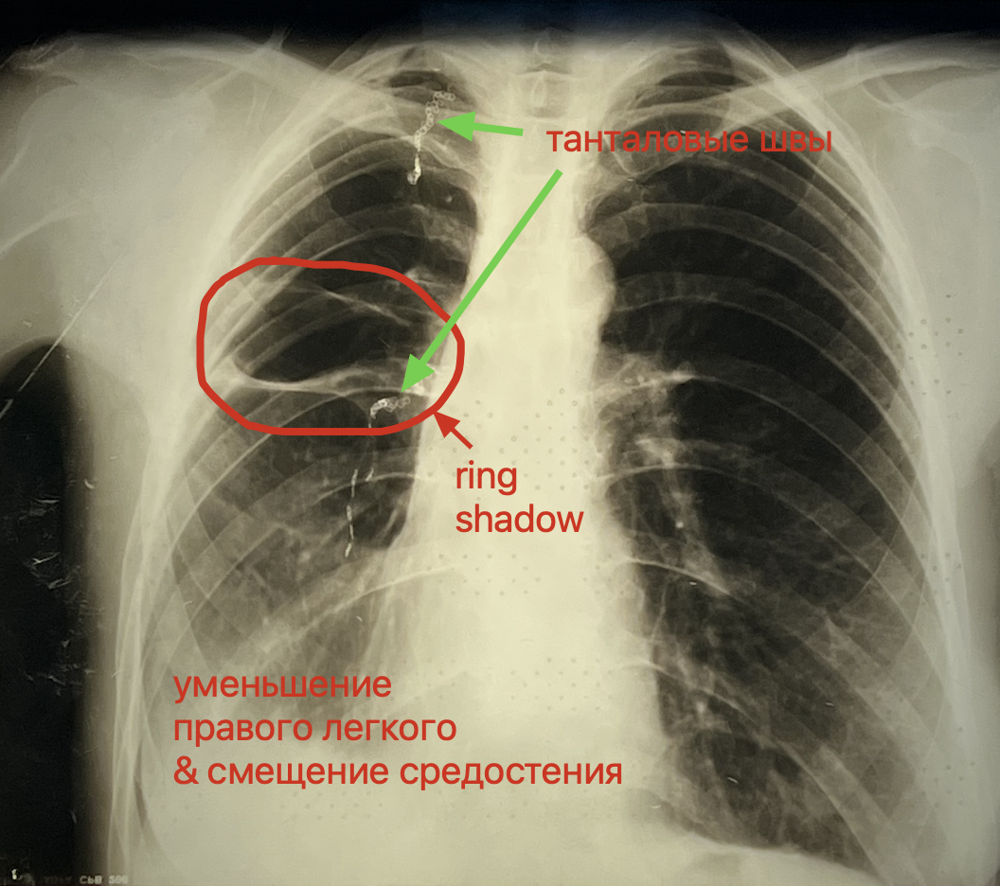
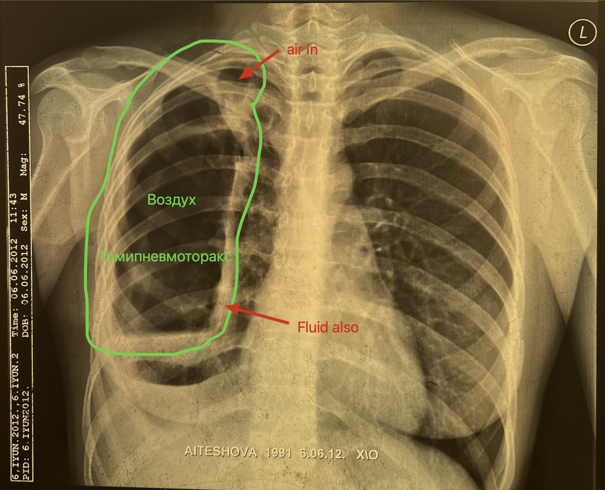
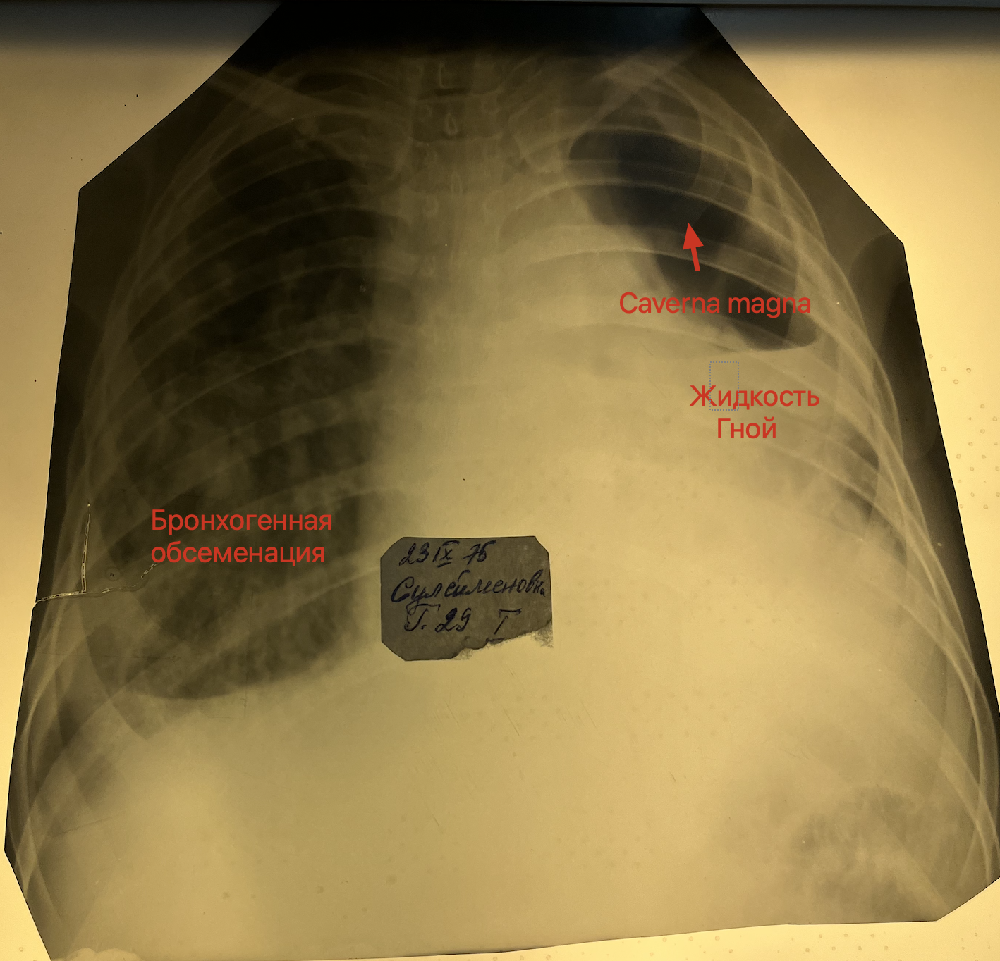
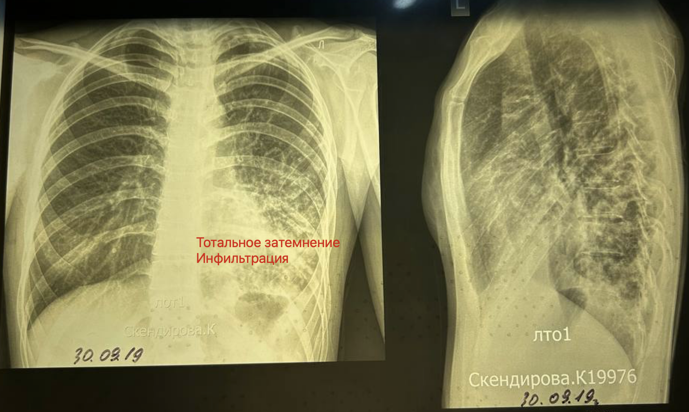

# Lecture notes
- **Laboratory diagnosis**
	- Bacterioscopic (TB is present or not)
		- Luminescent bacterioscopy is more accurate.
	- Bacteriologic smear (patient contagious or not)
	- Molecular-genetic (determination of the drug resistancy)
		- G-xpert (PCR method)

- If there is a **blood** in the sputum - **G-xpert** (PCR method) is not performed, because it can give a false result.

- Usually mantoux not performed for adults, only when:
	- *This is important to exclude latent tuberculosis and prevent reactivation of tuberculosis*
		- Gonovaccine (Gonococcal vaccine)
		- Пересадка органа
		- Генно-биологические

# X-ray diagnosis

- Очаг это изменение до 1 см.
- Fibrous alveolitis looks like disseminated tuberculosis.
- Сливающиеся очаги с участками просветления
	- Когда очаги сливаются, между ними образуются очаги просветления.
- Участки с просветлением в центре - признак *карцинаматоза*.
	- Зачастую однородное затенение
- Боковой снимок чтобы лучше разглядеть наличие жидкости, очаги и другие образования.
- Бронхогенная обсеменация
	- При кашле мокрота попадает ниже по ходу бронхов и заражает ткани ниже.
- Тени
	- Округлая/Фокусная
	- Кольцевидная

## Case 1: Primary tuberculosis (lymphangeitis)

- Teen young patient so it might be primary.

## Case 2: Infiltrative tuberculosis

- Bronchoectasis
- В стадии распада (участки просветления в области инфильтрации)

## Case 3: Acute disseminated tuberculosis

- This is acute process because spots are separated and very small in size.
	- These little spots will form bigger structures which will be in chronic processes.

## Case 4: Tuberculoma

- Differential diagnosis
	- Periphery tumor of lung (white round spot)
	- Echinoccosis
	- Filled cyst
	- Homotochondroma

## Case 5: Увеличение паратрахеальные и бронхопульмональные лимфотические 

- 5 year old kid
- Расширение тени средостения
- Паратрахеальные лимфотические узлы на протяжении корней легких
- Differential diagnosis
	- Sarcaidososis

## Case 6: Ring shadow

- Ring shadow (Кольцевидная тень)
- Танталовые швы (скрепки в легких) - цепочка в легких
	- Производилась операция. Это является причиной смещения средостения.
- This is woman (because mammary glands visible)
- Emphysematous process on the lower parts of lung

## Case: Atelectasis

- Справа в нижней доле затенение с распадом
- Справа в верхней доле ателектаз легкого
- Левое легкое разрушено по причине ателектаза

## Case: Hemipneumothorax

## Case: Fibrous-cavernous tuberculosis

- Справа бронхогенная обсеменация
- Caverna magna слева

## Case: Infiltration process with pleuritis

- Инфильративные изменения в нижней доле левого легкого с осложнением плеврита
- В нижней доле тотальное затемнение

# Flashcards

When x-ray front shot lung is not enough - side shot is used. **What is purpose of side shot?** #card 
On side shot it's better to see spots, fluid and other structures of lungs.
^1667482415284

# References
1. [Tuberculosis - X-ray diagnostics](http://www.learningradiology.com/notes/chestnotes/tbpage.htm)

