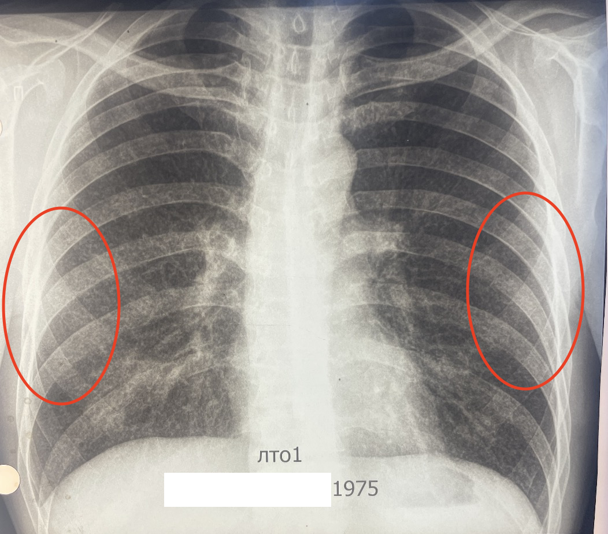

# Overview

Necessary for dissemination to occur: hyperergic state of the body, massive infection by the MBT, also a sharp decrease in immunity.

# X-ray

## General
- In disseminated tuberculosis usually damaged upper and medial parts of lungs.

## Acute: Miliary tuberculosis
- Mantoux negative
- Однотипные мелкие очаги
- Малой интенсивности
## Subacute
- Полиморфные очаги
	- Разной величины
	- Малой и средней интенсивности
## Chronic
- Criterias
	- Presence of *Caverna*
	- Присутствие старых и свежих очагов
		- Если будут только старые → значит *positive Исход*
## Outcome (favorable)
- Старые и кальцинированные очаги

# Differential diagnosis
- Pneumonia
- Fibrosing alveolitis
- Carcinomatosis
- Pneumococcosis
- Sarcaidosis
- Collagenoses

# Practical cases
## Case 1: Disseminated tuberbulosis

- Chronic disseminated tuberbulosis
- Очаговые тени во всех отделах обоих легких
- Нижняя доля слева норм

## Case 2: Очаговый туберкулез

- Очаги в верхних долях высокой интенсивности

## Case 3: Miliary(Просовидные) tuberculosis

- Мелкие точечные изменения (в виде шума)
- Легочный рисунок

## Case 4: Subacute disseminated tuberculosis

- Полиморфные очаги
- Слева слияния очагов

## Case 5: Исход

- Кальцинированные очаги
- Очаги высокой интенсивности
- Верхняя доля правого легкого уменьшена
- Буллезные дистрофические изменения (справа сверху)

## Case 6: Acute disseminated tuberculosis

- Очаги однотипные множественные (от верхушки до диафрагмы)

## Case 7: Carcinomatosis

- Слева слияние очагов
- Фокусная тень в верхней доле левого легкого

## Case 8: Исход

- Пневмоперитонеум метод старый метод лечение туберкулеза в фазе распада (инфильтрация в фазе распада и каверны). Диафрагма приподнимает легкие что приводит к соприкосновению стенок раны и процесс заживления идет быстрее.

# Flashcards

What is the Mantoux result in Miliary tuberculosis? And why? #card 
Negative, because no immune response.
^1667362072436
