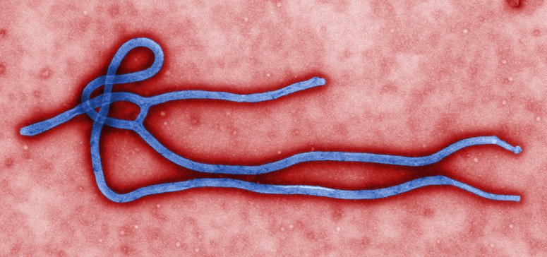

# Overview

### Black stool in Ebola infection

>The _stools_ were initially watery and clear, but turned *black* or contained red blood in 66.2% of all cases with bleeding history [1]

# Flashcards

What is the pathogen of Ebola? #card 
Ebolavirus, a **filovirus** - filamentous RNA virus
^1666092970362

What is the genetic molecule structure of Ebolavirus? #card 
Negative-sense single stranded RNA virus
^1666093588923

What is the shape of Ebolavirus? #card 
"thread-like" shape

^1666094832784

Incubation period of the Ebola? #card 
up to 21 days
^1666093380557

CIinical symptoms of Ebola: (at least 3) #card 
Flulike symptoms, diarrhea/vomiting, high fever, myalgia
^1666093380560

What is the common complications of Ebola? (3) #card 
DIC, diffuse hemorrhage, shock, death (high mortality rate)
^1666093380562

Which laboratory method is used to diagnose Ebola? #card 
RT-PCR withing 48 hours of symptom onset
*Reverse transcription PCR (RT-PCR) - allows the use of RNA as a template.*
^1666093380563

# References
1. [CLINICAL ASPECTS OF EBOLA VIRUS INFECTION IN YAMBUKU AREA, ZAIRE, 1976.](http://www.enivd.de/EBOLA/ebola-11.htm)