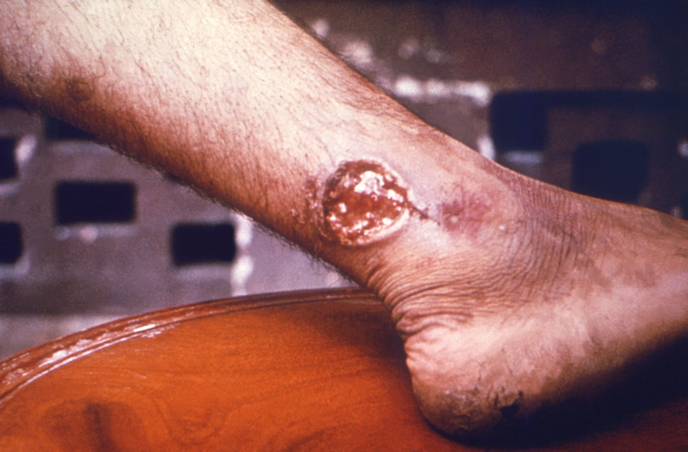
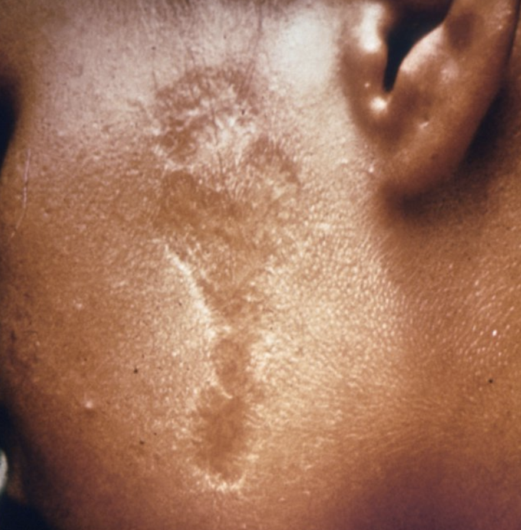

# Overview

- Pathogen: Leishmania (protozoa, class flagellate)
- Vector: phlebotomine **sandfly** ("москиты")
- Reservoirs: rodents, dogs, foxes
- Pathogen types
	- L. donovani - visceral
	- L. tropica - cutaneous
	- L. mexicana - central American
	- L. brasiliensis - brasilian (cutaneous-mucosal)
- Clinical types
	- **Cutaneous (most common)**
		- By the path of Lymph nodes
		- Skin sores
			- Not painful
		- Swollen glands
		- 
		- 
	- **Visceral (most severe)** Kala-azar (in hindi "black fever")
		- affects internal organs
			- spleen
			- liver
			- bone marrow
		- Symptoms
			- Fever
			- Weight loss
			- Anemia
			- Hepatosplenomegaly (super-duper big)
	- **Mucosal**
		- Destruction of mucous membranes of nose, mouth, throat.
		- Sores are painful
- Diagnosis
	- PCR
	- Urine test
	- Microscopic
	- Lab: pancytopenia
		- Neutropenia
		- Eosinopenia
		- Thrombocytopenia
- Treatment
	- "Препараты сурьмы"
	- Pentavalent antimonial
	- Amphotericin B
	- Pentamidine
	- Mitefosine
	- Aminosidine
	- Imidazoles