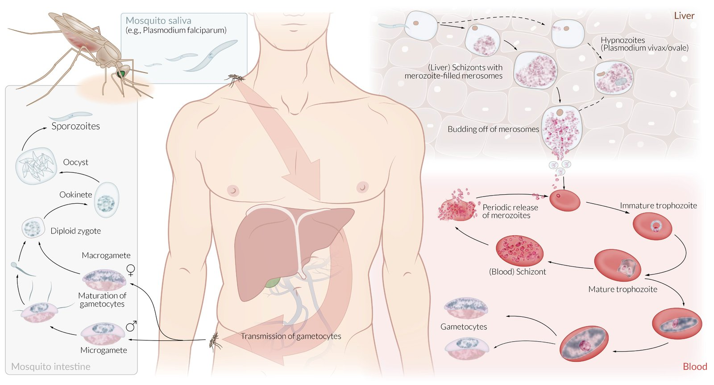

tags: #malaria #tropical-diseases #inprogress 

# Lecture notes

- Malaria in kazakh - "Безгек"- Reservoir is human. Transmitted by mosquites.
- Hot weather countries. 

## Pathogenesis

- Mosquite bite → liver → transformed to merozoites → release of merozoites to the bloodstream → merozoites enter erythrocytes → erythrocyte schizonts are formed → release of merozoites into the bloodstream → penetration of erythrocytes recurs
- **If erythrocytes will die every second day:**
	- They die in the spleen so → splenomegaly
	- Hemolytic anemia → Hypoxia
	- Activation of bone marrow → more erythrocytes are formed 
	- While there is a increase of erythrocytes, other blood cells are reduced → which causes pancytopenia, thrombocytopenia, leukopenia
- **P falciparum malaria - "Tropic malaria" causes most severe coma**
	- Why it's dangerous? 
	- Exoerythrocytic schizonts formed in liver, but in case of tropic malaria → also in the brain and kidney vessels endothelium
- **Incubation period**
	- Cyclic fevers have prodrome period

## Course of disease
- Malaria begins with Озноб, трясется (3 hr)
- Temperature rise (ему жарко) (5-6 hr)
	- Headache, vomiting, diarrhea, intoxication
- Sudden decrease of temperature
	- from 40 to 35
	- sweating, profuse sweating → обезвоживание
- Sleep (после всего этого сил нет и уснул)
	- if it's tropic malaria → can be coma

- Anemia worsened by the fever cycles
- Examination
	- Subicteric sclera
	- Hepatosplenomegaly
	- Systolic murmur, tachicardia, hypotonia
- Пирогенные вещества с каждым циклом увеличиваются
- Need to get толстая капля крови - микроскопия to see merozoides, taken during 48 hr onset of disease.
- Indirect bilirubinemia
- if tropic - increased creatinine

# Flashcards

What is the pathogen of malaria? #card 
Plasmodia parasite (protozoa) - простейшие
^1666088329992

An organism that transmits a malaria pathogen? #card 
the **female** Anopheles mosquito

^1666088500190

What is the incubation period of malaria? #card 
**7-30 days**. Minimum of 7 days.
^1666091867657
[[Crimean-Congo hemorrhagic fever (CCHF)]] Crimean-Congo hemorrhagic fever (CCHF)
Name the main clinical features of malaria disease: (at least 3) #card 
Flu-like symptoms, cyclic fevers, headache, anemia, hepatosplenomegaly, hypoglycemia in severe cases, diaphoresis - sweating
^1666091867662

What is the difference in manifestation of plasmodium species (fever spikes)? #card 
Duration of fever cycle.
^1666091867664

Name the main species of the malaria pathogen: (3-4) #card 
- P malariae
- P vivax/ovale
- P falciparum
^1666091867668

Explain the fever pattern of each malaria pathogen: #card 
- P malariae: 72-hr fever cycle (quartan)
- P vivax/ovale: 48-hr fever cycle (tertian)
- P falciparum: Severe, irregular fever pattern
^1666091867670

Which main drugs used to treat malaria? #card 
- if *sensitive*, **chloroquine**
	- if *resistant*, **mefloquine**, **doxycycline** or **atovaquone**/**proguanil**
- if *life threatening*, use intravenous **quinine** or **artesunate** (test for G6PD deficiency - because can be resistent to this drug)
^1666091867673

What is **hypnozoite** in malaria disease? #card 
Those are **dormant malaria parasites** that can reactivate and relapse after months or even years.
^1666091867674

Which species of plasmodium forms **hypnozoites**? (2) #card 
Plasmodium vivax/ovale
^1666091867675

What drug should be added in case of presence of **hypnozoites**? #card 
**primaquine** to target hypnozoites
^1666092944994

Name the prevention methods against mosquito bite: (2) #card 
- Caution during peak biting periods, mosquito nets, protective clothing, mosquito repellent, such as DEET (N,N-diethyl-meta-toluamide)
- Insecticide spraying
^1666092163711

What antimalarial drugs are safe to use during pregnancy? (2) #card 
Chloroquine, mefloquine
^1666092243981

What drug you should take in case of travel to exotic countries? #card 
*One week before and after the trip to exotic countries.*
Delagil 1 pill/day
^1666164989818

Malarial sporozoites travel by bloodstream to the liver where they are asexually multiply into {1:schizonts} containing thousands of {2:merozoites}
^1666165225196

Thousands of Merozoites travels by bloodstream and enters the erythrocytes, forming erythrocyte {1:shizonts}.
^1666172886431

Why does splenomegaly occurs in the case of the hemolytic anemia in malaria disease? #card 
Erythrocytes death occurs in the spleen → splenomegaly
^1666172886440

What it the most severe type of malarial plasmodium? #card 
Plasmodium falciparum (which causes Tropic malaria)
^1666172886442

Erythrocytic schizonts formed in the liver, but in P falciparum malaria schizonts formed also in {1:brain} and {1:kidney} vessels endothelium. In result, tropic malaria leads to more severe coma.
^1666172886443

Why there is a pancytopenia occurs in the malaria disease? #card 
Hemolytic anemia leads to activation of bone marrow to produce more erythrocytes. Which causes relative decrease of other cells of blood. (e.g. Thrombocytopenia, leukopenia and etc.)
^1666175430157

What symptoms are revealed on examination of patient with malaria? (at least 3) #card 
Subicteric sclera, hepatosplenomegaly, systolic murmur (tachycardia, hypotonia)
^1666175430161

From malaria patient **thick drop of blood is taken to microscopy** to see {1:merozoides}. This should be done during 48 hr onset of disease.
^1666175430163

What type of bilirubin increases in case of malaria? #card 
Indirect bilirubin
^1666175430166

Why in tropic malaria fever there is a creatinine increase? #card 
Because P falciparum, which causes **tropic malaria affects not only liver but also kidney and brain vessels endothelium.**
^1666175430168

## Flashcard references
1. [Malaria amboss](https://www.google.com/url?sa=t&rct=j&q=&esrc=s&source=web&cd=&cad=rja&uact=8&ved=2ahUKEwio6Pa7xen6AhVqDRAIHYGtBlsQFnoECA0QAQ&url=https%3A%2F%2Fwww.amboss.com%2Fus%2Fknowledge%2FMalaria%2F&usg=AOvVaw1ztCtkQviOUXMgxIbt4Dv-)
