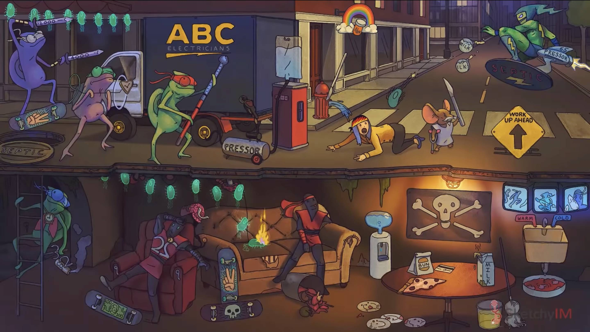
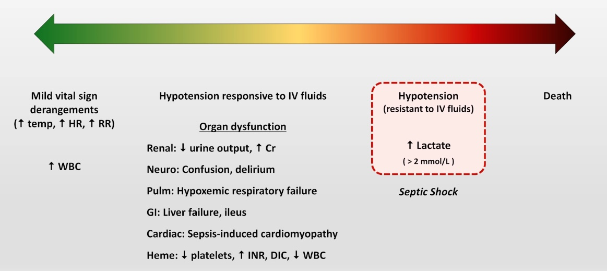
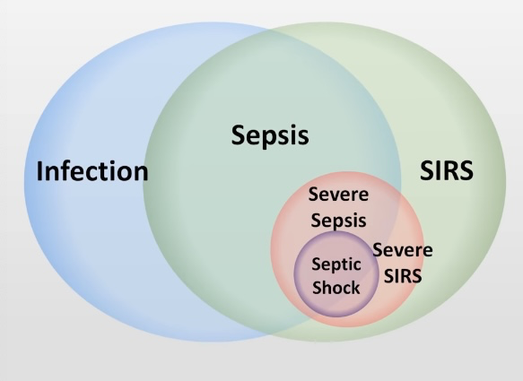
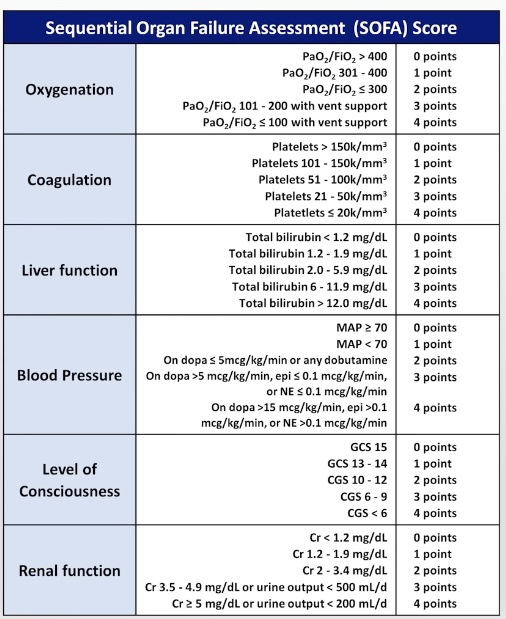
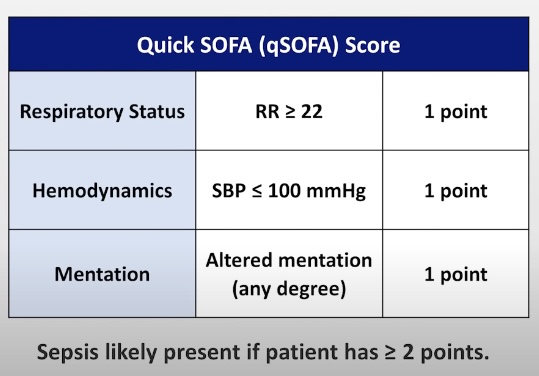
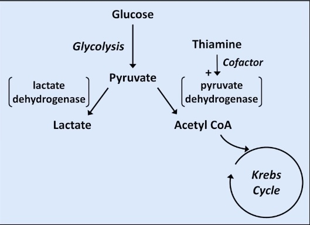

tags: #pathophysiology #critical-care 
status: #inprogress 
flashcards: [[Sepsis. Septic shock flashcards]]

---
## Sketchy

## Definition of sepsis
- Life-threatining organ dysfunction caused by dysregulated host response to infection.
- this is not clinically useful
	- 
- SIRS is RIP
- SOFA score
	- 
- qSOFA was created
	- 

## Signs of sepsis
*Present if > 2 of the following are present*
- **T> 38° C (100.4°F) or < 36°C (96.8°F)**
	-  #why 
- **Pulse > 90 beats/min**
	- Systemic inflammation from sepsis causes vasodilation and reduces the systemic vascular resistance #how , heart rate will increase in attempt to maintain blood pressure. This compensatory mechanism is the reason why tachycardia develops first before hypotension.
- **RR > 20/min or $PaCO_2$ < 32 mmHg**
	- This happens due to combination of direct *cytopathic lung injury* & systemic inflammatory effects on medullary *respiratory center* and compensation from metabolic acidosis with *respiratory alkalosis*.
- **WBC > 12,000/mm3 or < 4000/mm3**
	- Left shift leukocytosis means there is more immature neutrophils. ([[Leukogram]])
- **Platelets <100k**
	- Advanced sepsis causes decline of platelets count.
- **Serum Lactate**
	- Byproduct of anaerobic metabolism.
	- Despite adequate volume resuscitation.
- **Hypotension (SBP <100 mmHg)**
	- **or MAP[^1] <65 ()** even after adequate fluid resuscitation.
	- Compensatory mechanisms of organism exhausted and blood pressure started to fall.

## Signs of Septic shock
>[!tip] SOFA + Lactate >2 mmol/L + MAP<65 mmHg
- Early septic shock is a type of distributive [[Cardiogenic shock]]
	- ![[Cardiogenic shock#^distributive-shock]]
### On physical examination
- *Early septic shock:* Warm extremities due to vasodilation.
- *Late septic shock:* Cold extremities due to peripheral vasocontriction.
---

- Sepsis patient should have organ dysfunction.
## Signs of end-organ dysfunction
- **Encephalopathy**
	- Altered mental status.
- **↓ Urine output**
	- Manifestation of acute kidney injury due to poor renal perfusion.
- **↑ serum BUN[^2] & Creatinine:** Renal dysfunction
- **Leukocyte esterase:** a type of enzyme produced by leukocytes in urine.
- **↑ bilirubic:** Hepatic dysfunction

## Diagnosis
*The main aim here is to find the source of infection.*
- Thorough exam
- Blood culture
- UA & urine culture 
	- UTI[^4] - a common source of infection leading to sepsis.
- Other relevant cultures
- Chest X-ray: look for pneumonia
- Consider abdominal imaging (CT vs US)

## Treatment 
- **ABCs**[^3] (i.e. ensure pulse and respirations)
	- Restore hemodynamics
		- IV fluid boluses
			- Crystaloid fluid rather than colloids.
			- Balanced solutions (e.g. LR) > "Normal" saline
			- General guideline: 30mL/kg within the first 3 hrs
- **Vasopressors** (if fluids insufficient)[^5]
	- *Norepinephrine* first choice in septic shock
	- Vasopressin, epinephrine, dopamine, dobutamine, and phenylephrine are all potentially reasonable as a second med to add, depending on circumstances.
>[!tip] Epinephrine vs dopamine, dobutamine
>In older patients with a history of heart failure better dopamine and dobutamine
- **Treat the underlying infection**
	- Broad spectrum antibiotics (<1 hr vs. ASAP (As soon as possible))
	- Source control (e.g. drain abscess, d/c potentially infected line)

## Signs of adequate resuscitation
- MAP (Mean Arterial Pressure) ≥ 65 mmHg
- Urine output ≥ 0.5 mL/kg/h
- Normalized mental status
- Improving lactate 
- Variety of dynamic measures of hemodynamics in mechanically ventilated patients

## Identify complications
- CBC - anemia, thrombocytopenia
- DIC panel (e.g. INR, aPTT, fibrinogen) - DIC
- Metabolic panel - AKI, ↑ AG metabolic acidosis
- Lactate - Systemic hypoperfusion (?)
- LFTs - ischemic hepatitis, hyperbilirubinemia
- ABG - Quantify $PO_2$ , identify ↑ $PCO_2$ , assess pH
- Chest X-ray - Pulmonary edema (e.g. non cardiogenic ARDS, as well as cardiogenic)
- Troponin - type 2 MI
- ECG - ischemia, arrythmias
- Echo - sepsis induced cardiomyopathy
- *refractory condition* - when patient remain hypotensive despite receiving an appropriate amount of fluids and being on at least one presser (raising the blood pressure)

## Miscellaneous Issues
- Avoid vancomycin + pip/tazo (Zosyn®) due to 1 risk of AKI (Acute Kidney Injury
	- (Alternatives for empiric broad coverage:
	  vancomycin + cepefime, vancomycin + a carbapenem)
- Consider empiric steroids in refractory septic shock.
- "Early goal directed therapy" (EGDT) is no longer superior to "standard care". (probably because standard care has gotten so much better)
- In the absence of ongoing hemorrhage or active myocardial ischemia, BC transfusions should only be given when Hb < 7 g/dL.

## Interesting additional issues
> [!warning] Minority opinion warning
- Lactic acidosis - not caused by tissue hypoxia?
	- Not caused by hypoxia and subsequent anaerobic respiration
	- Alternative hypothesis:
		- In *Shock* intrinsic beta-agonist activity leads to an increase in the rate of pyruvate production, which then overwhelms the Krebs cycle's ability to process it. 
			- 
- Vitamin C protocol (+thiamine & hydrocortisone)
	-  NOT CONFIRMATIVE! NO TRIALS ON IT!

# References
1. [Sepsis & Septic Shock - SketchyIM video](https://youtu.be/lrMSBn2t-S8)

[^1]: Mean Arterial Pressure
[^2]: Blood Urea Nitrogen test: measures how much of the waste product you have in your blood
[^3]: Airway, breathing, and circulation
[^4]: Urinary Tract Infections
[^5]: Should be added if IV fluids fail to restore organ perfusion → aim for MAPs >= 65 mmHg 