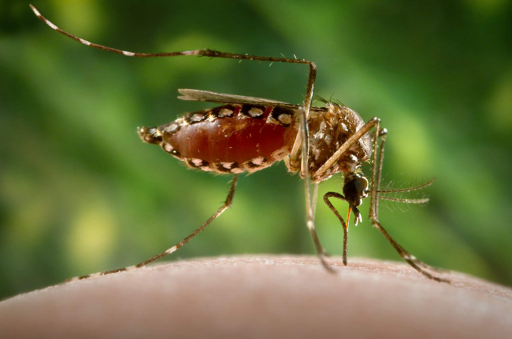

# Overview

- **Pathogen**: Yellow fever virus
	- Flavivirus (also an arbovirus) transmitted by **Aedes mosquitoes**
		- *Flavi = yellow, jaundice*
	- Monkey or human reservoir.
- **Symptoms**
	- High fever
	- Black vomitus
	- Melena - black or tarry stool (which is degraded blood)
	- Jaundice
	- Hemorrhage
	- Backache
- **Diagnosis**
	- PCR, ELISA
	- Lab
		- ALT, AST ↑
		- Leukopenia, thrombocytopenia
		- ↑ PTT (partial thromboplastin time)
	- Liver biopsy - may see **Councilman bodies** (eosinophilic apoptotic globules)
- **Vaccine**
	- Live, attenuated vaccine recommended for travelers to endemic countries.

# Flashcards

What is the pathogen of Yellow fever? #card 
**Yellow fever virus** (genus: flavivirus), single-stranded RNA virus
^1666776322814

Which organism transmits yellow fever virus? #card 
**Aedes mosquitoes**

^1666776322826

Main reservoirs of Yellow fever are {1:primates (human and monkey)}
^1666776322828

Liver biopsy in case of **Yellow fever** reveals *eosinophilic apoptotic globules* which are called {1:Councilman bodies}.
^1666776322833

What is the results of laboratory tests (blood) in Yellow fever disease? #card 
- ALT, AST ↑
- Leukopenia, thrombocytopenia
- ↑ PTT (partial thromboplastin time)
^1666776322834

